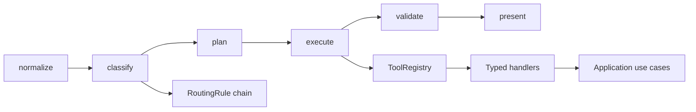

# Componentes do agente

```mermaid
flowchart LR
  N[normalize] --> C[classify]
  C --> P[plan]
  P --> E[execute]
  E --> V[validate]
  V --> R[present]
  C --> Rules[RoutingRule chain]
  E --> Registry[ToolRegistry]
  Registry --> Handlers[Typed handlers]
  Handlers --> UseCases[Application use cases]
```

O registry é a fonte de schema, risco, autenticação e confirmação. Identidade é passada no contexto de execução e não é persistida em checkpoints.
