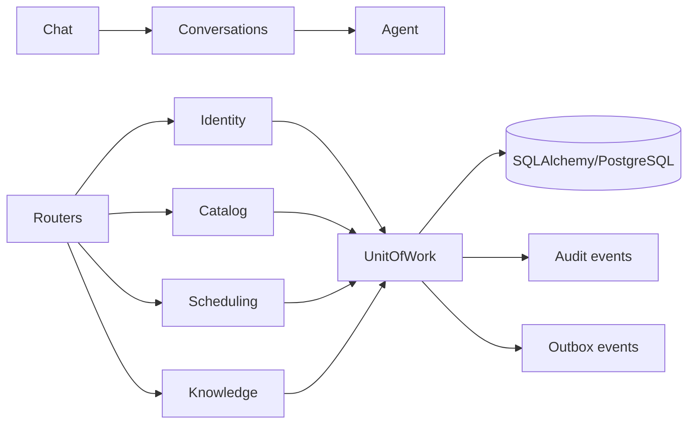

# Componentes do backend

```mermaid
flowchart LR
  Routers --> Identity
  Routers --> Catalog
  Routers --> Scheduling
  Routers --> Knowledge
  Chat --> Conversations
  Conversations --> Agent
  Identity & Catalog & Scheduling & Knowledge --> UOW[UnitOfWork]
  UOW --> SQL[(SQLAlchemy/PostgreSQL)]
  UOW --> Audit[Audit events]
  UOW --> Outbox[Outbox events]
```

Routers autenticam, validam DTOs, invocam um caso de uso e traduzem sua resposta. Queries devolvem DTOs de leitura paginados; comandos não chamam `commit`.
