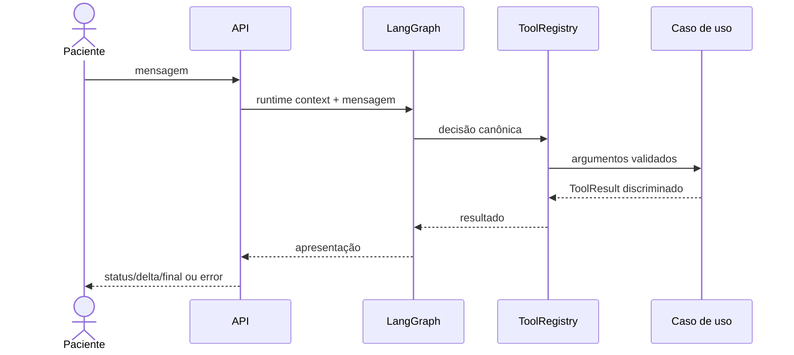

# Fluxo de chat

```mermaid
sequenceDiagram
  actor P as Paciente
  participant API
  participant A as LangGraph
  participant T as ToolRegistry
  participant U as Caso de uso
  P->>API: mensagem
  API->>A: runtime context + mensagem
  A->>T: decisão canônica
  T->>U: argumentos validados
  U-->>T: ToolResult discriminado
  T-->>A: resultado
  A-->>API: apresentação
  API-->>P: status/delta/final ou error
```
