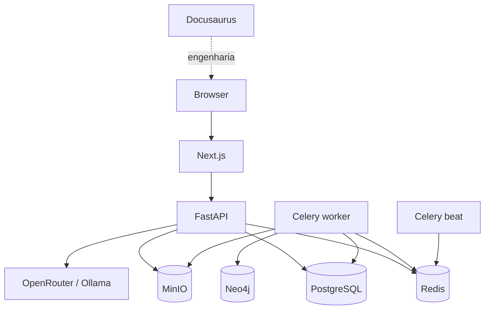

# Contêineres — C4

```mermaid
flowchart TB
  Browser --> Web[Next.js]
  Web --> API[FastAPI]
  API --> PG[(PostgreSQL)]
  API --> Redis[(Redis)]
  API --> MinIO[(MinIO)]
  API --> LLM[OpenRouter / Ollama]
  Worker[Celery worker] --> PG
  Worker --> Redis
  Worker --> Neo4j[(Neo4j)]
  Worker --> MinIO
  Beat[Celery beat] --> Redis
  Docs[Docusaurus] -. engenharia .-> Browser
```
