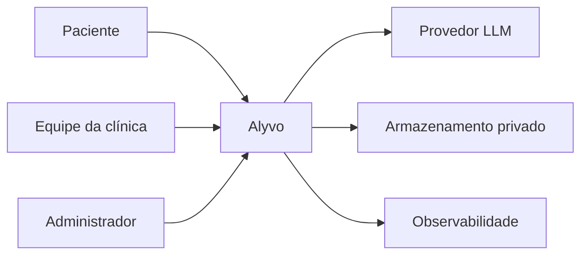

# Contexto — C4

```mermaid
flowchart LR
  Patient[Paciente] --> Alyvo[Alyvo]
  Staff[Equipe da clínica] --> Alyvo
  Admin[Administrador] --> Alyvo
  Alyvo --> LLM[Provedor LLM]
  Alyvo --> Storage[Armazenamento privado]
  Alyvo --> Observability[Observabilidade]
```

O sistema agenda, cancela, consulta diretório e publica conhecimento administrativo. Não diagnostica, prescreve nem realiza triagem clínica.
