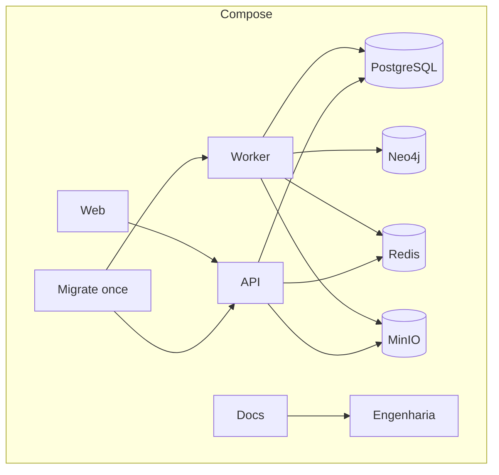

# Deployment

```mermaid
flowchart TB
  subgraph Compose
    M[Migrate once] --> API
    M --> Worker
    API --> PG[(PostgreSQL)]
    Worker --> PG
    Worker --> N[(Neo4j)]
    API & Worker --> R[(Redis)]
    API & Worker --> S[(MinIO)]
    Web --> API
    Docs --> Engineer[Engenharia]
  end
```

API e worker nunca alteram schema no startup. `migrate` deve terminar antes de ambos; `seed` é explícito, sintético e idempotente.
