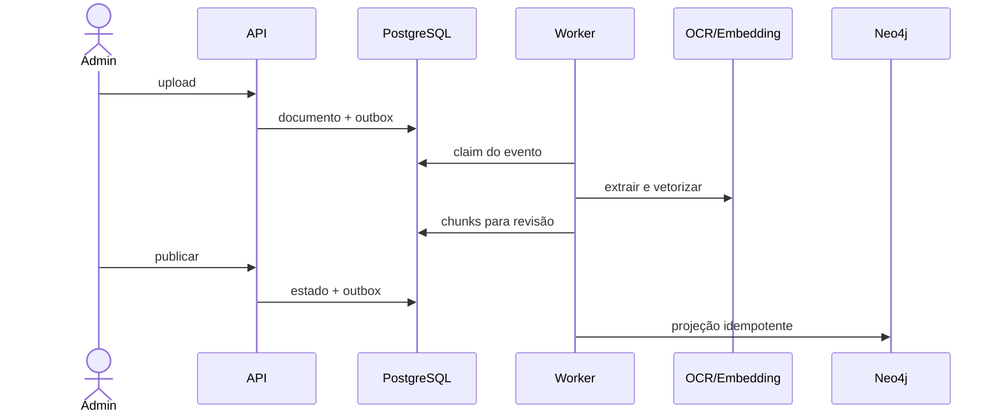

# Fluxo de conhecimento

```mermaid
sequenceDiagram
  actor A as Admin
  participant API
  participant DB as PostgreSQL
  participant W as Worker
  participant O as OCR/Embedding
  participant N as Neo4j
  A->>API: upload
  API->>DB: documento + outbox
  W->>DB: claim do evento
  W->>O: extrair e vetorizar
  W->>DB: chunks para revisão
  A->>API: publicar
  API->>DB: estado + outbox
  W->>N: projeção idempotente
```
