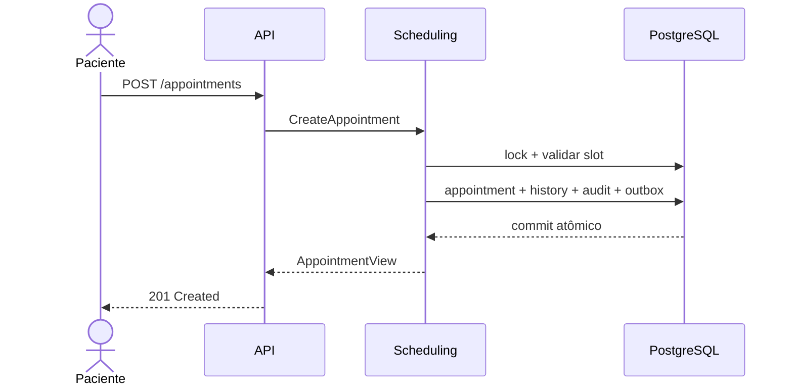

# Fluxo de agendamento

```mermaid
sequenceDiagram
  actor P as Paciente
  participant API
  participant S as Scheduling
  participant DB as PostgreSQL
  P->>API: POST /appointments
  API->>S: CreateAppointment
  S->>DB: lock + validar slot
  S->>DB: appointment + history + audit + outbox
  DB-->>S: commit atômico
  S-->>API: AppointmentView
  API-->>P: 201 Created
```

No PostgreSQL, a exclusion constraint GiST também impede sobreposição de consultas confirmadas do mesmo médico.
